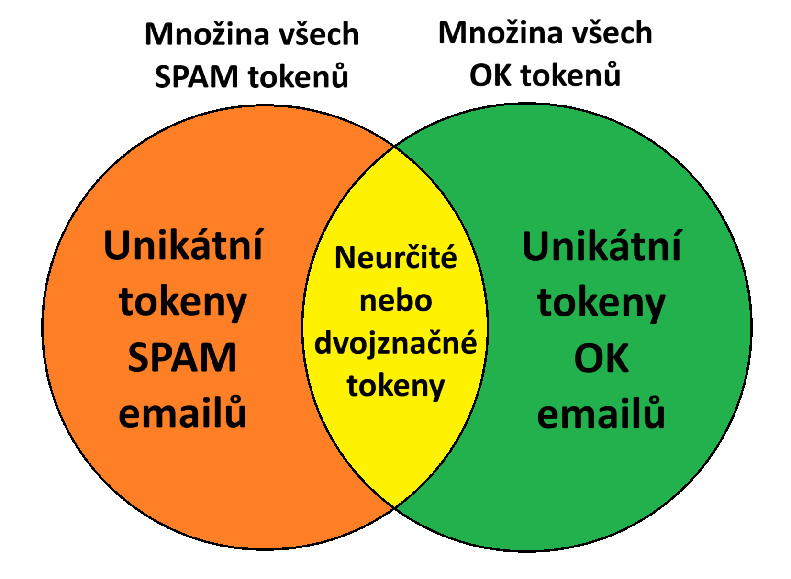
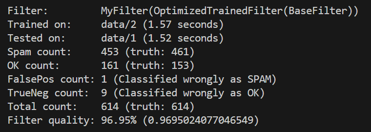
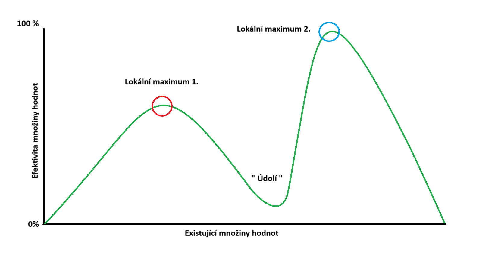

# Spam Filtr (REPORT)
## Autoři projektu

- Martin Koutský (koutsma1@fel.cvut.cz)
- Oleksii Kolesnichenko (kolesole@fel.cvut.cz)

## Stručný úvod 

- Projekt slouží pro klasifikaci textových emailů do kategorií SPAM a OK.

- Více informací naleznete na stránkách zadání projektu:\
https://cw.fel.cvut.cz/wiki/courses/b4b33rph/cviceni/spam/start

## Popis principu/algoritmu použitého spam filtru

- Spam filtr funguje na základě tokenizace textového obsahu emailů do skupin dle hlaviček dostupných dat (například "body", "from", "subject", ...) dle struktury emailů podléhající normě RFC5322 (příp. RFC2822), a porovnává podobnost tokenů ("slov", chcete-li) mezi množinou z právě klasifikovaného emailu a množinami uložených unikátních tokenů pro kategorie SPAM a OK emailů.

## Popis způsobu trénování filtru

- Filtr tokenizuje obsah jednotlivých hlaviček emailů z tréninkového korpusu, a uloží si do paměti tokeny ("slova", chcete-li) které jsou unikátní pro tuto hlavičku a kategorii emailů. Tokeny jsou dále normalizovány tak, aby se co nejvíce změnšila množina učených dat (například konverzí všech velkých písmen na malé, odstraněním veškerých nežádoucích symbolů, uložení pouze přezdívky z emailové adresy nebo domény z URL adresy apod.).

- Příklad; Filtr dostal k naučení jeden SPAM email, a jeden OK email.

        SPAM_email = {
            "from":      "unknown@gmail.com",
            "subject":   "WIN FREE IPHONE 15 NOW",
            "body":      "OBTAIN FREE IPHONE 15 -> www.suspiciousURL.com/winiphone"
        }

        OK_email = {
            "from":      "friend@gmail.com",
            "subject":   "My iphone broke again",
            "body":      "Hey Joe! Would you repair my iphone?"
        }

- Filtr tokenizuje jednotlivé hlavičky, každý token normalizuje a uloží si ty, které se nenachází v druhé kategorii emailů. Naučená data z předešlých dvou emailů, o kterých víme, do jakých kategorií spadají, mohou vypadat takto:

        SPAM_model = {
            "from":      ("unknown"),
            "subject":   ("win", "free", "now"),
            "body":      ("obtain", "free", "suspiciousurl")
        }
        
        OK_model = {
            "from":      ("friend"),
            "subject":   ("my", "broke", "again"),
            "body":      ("hey", "joe", "would", "you", "repair", "my")
        }
    

- Všimněme si, že tokeny jsou vážně unikátní, tzn; veškeré tokeny, které se objevily v obou kategoriích tréninkových emailů (dvojznačné nebo neurčité, chcete-li), byly vyřazeny. Z grafu dole je patrné, že nás zajímají pouze tokeny v oranžové a zelené části, a že intersekce (žlutá část) nám s klasifikací nijak nepomůže.

- Je samozřejmé, že s tak malou množinou tréninkových dat nebude filtr klasifikovat zas tak dobře. Proto je žádoucí, aby bylo pro trénink poskytnuto co nejvíce dostupných dat. Pro případ, že by nová instance filtru musela klasifikovat bez předešlého tréninku, jsou v souborovém *.pickle* balíčku filtru přibalena před-natrénovaná data z 1228 emailů které si filtr sám načte ze souboru.

## Popis způsobů klasifikace emailů

- Filtr má buď načtená před-natrénovaná data ze souboru, nebo byl naučen na natestovacím korpusu (nebo obojí) a má tak sady tokenů pro jednotlivé kategorie emailů, rozdělené dle hlaviček. Tyto sady tokenů můžeme nazvat "modely". Máme tedy model pro SPAM email a OK email.

- Řekněme, že má filtr naučená/načtená data z minulého paragrafu, tedy:

        SPAM_model = {
            "from":      ("unknown"),
            "subject":   ("win", "free", "now"),
            "body":      ("obtain", "free", "suspiciousurl")
        }
        
        OK_model = {
            "from":      ("friend"),
            "subject":   ("my", "broke", "again"),
            "body":      ("hey", "joe", "would", "you", "repair", "my")
        }

- Při klasifikaci jednotlivých emailů z dochází k porovnávání tokenů jednotlivých hlaviček emailu s tokeny hlaviček jednotlivých modelů. Intersekce těchto dvou množin tokenů je naše výsledná pravděpdobnost pro jednotlivé hlavičky.

- Řekněme, že klasifikujeme následující email, o kterém nevíme do jaké kategorie spadá:

        UNKNOWN_mail = {
            "from":      "someone@gmail.com",
            "subject":   "Receive free income every month!",
            "body":      "Hey! Reach out to our broker at SusPiCiousURl.com/income.html 
                          and get your free money now!"
        }
        
- Po tokenizaci a normalizaci se tokeny nového emailu porovnají s tokeny hlaviček obou modelů výše, a pro každou hlavičku vypočítá hodnotu pravděpodobnosti dle následující rovnice:
        
    **Počet tokenů z hlavičky neznámého emailů, které se nachází v hlavičce modelu / počet tokenů nacházejících se s hlavičce modelu**
        
- Po výpočtech pro tokeny z neznámého emailu výše dostaneme následující hodnoty (zhruba):

        SPAM_model_prediction = {
            "from":      0,
            "subject":   1/3,    # ~= 0.33333
            "body":      2/3     # ~= 0.66666
        }
        
        OK_model_prediction = {
            "from":      0,
            "subject":   0,
            "body":      1/6,    # ~= 0.16666
        }

- Jelikož ale né každá hlavička má stejnou "váhu" ("důležitost", chcete-li), sečtení výsledných hodnot v jednotlivých modelech často není nejlepší řešení, a proto máme k dispozici seznam skalárů, které slouží jako váhy. Pokud si výsledky klasifikace pro hlavičky v modelech výše vyložíme jako vektor, a náš seznam "vah" také jako vektor, můžeme provést vektorový součin a získat finální, přesnější pravděpodobnost pro celkovou kategorii.

- Pro jednoduchost příkladu řekněme, že hodnoty Vah máme k dispozici následující:

        weights_for_models = {
            "from":      1,
            "subject":   0.5,
            "body":      1
        }

- Po vektorovém součinu s hodnotami OK modelu a SPAM modelu získáme:

        - Pravděpodobnost dle SPAM modelu:
            (1 * 0) + (0.5 * 1/3) + (1 * 2/3) = 5/6 ~= 0.8333
        
        - Pravděpodobnost dle OK modelu:
            (1 * 0) + (0.5 * 0) + (1 * 1/6) = 1/6 ~= 0.1666
        
- Vidíme tedy, že dle výsledných hodnot modelů je pro email výše větší pravděpodobnost, že se jedná o SPAM, než li o OK email.
    
- Mimo tohoto obecného algoritmu tokenizace dat hlaviček emailů Filtr také obsahuje malé množství jiných metod pro určení kategorie, jako například porovnání tokenů s předem připravenou sadou slov, která mají tendenci se častěji vyskytovat ve SPAM emailech. Níže je uvedena sada slov, která byla ručně sestavena a otestována jako optimální (ovšem pravděpodobně né nejoptimálnější):

        spam_keywords = [
            "porn", "erotic", "sex", "penis", "viagra", "free", "winner", 
            "congratulations", "urgent", "important", "guaranteed", 
            "winner", "rich", "millionaire", "billionaire", "lottery", 
            "sweepstakes", "prize", "claim", "offer", 
            "pharmacy", "medication", "loan", "debt", 
            "replica", "hot", "adult", "xxx",
            "girls", "teens", "sensual", "sexy"
        ]

## Popis způsobu nalezení optimáních hodnot Vah

- U předešlých příkladů bylo patrné, že by hodnoty Vah ani možná nebyly potřebné, a nebo by optimální hodnoty Vah šly nalézt/určit ručně. Testování na poskytnutých datech ovšem ukázalo, že unikátních hlaviček emailů existují stovky, a že né každá hlavička je stejně užitečná jako druhá pro klasifikaci. Testování tokenů na některých konkrétních hlavičkách dokonce výslednou kvalitu klasifikace zhoršují. Může také existovat mnoho kombinací hodnot Vah, které dosáhnou rúzných výsledků na různých sadách trénovacích a testovacích dat. Už jen z těchto úvah může vyplývat, že nalezení optimálních vah ručne pro stovky různých hlaviček by byl téměř nemožný úkol nepřemýšleje o tom, že by jsme to museli dělat opakovaně pro každou novou iteraci ("verzi", chcete-li) filtru.

- Pro nalezení optimálních hodnot použitých ve Filtru byl v testovacím prostředí implementován takzvaný "genetický" (nebo také nazývaný "evoluční") algoritmus, který pomocí kombinací a náhodných úprav Vah a skrze jejich testování na tréninkové a testovací sadě dat hledal nejoptimálnější hodnoty pro dosažení nejvyšší kvality klasifikace. Pro téměř každou úpravu filtru musel být tento algoritmus zavolán, aby našel nové nejoptimálnjší hodnoty Vah.

    - Příklady takových úprav Filtru jsou třeba úpravy v normalizaci tokenů, která pak mohla zapříčinit zvýšení nebo naopak snížení kvality klasifikace během testování na těchto nových tokenech z nějaké hlavičky (nebo vícero).

- Jelikož výše popsaný algoritmus potřeboval testovat kvalitu filtru opakovaně na neurčitý čas, byla při vývoji filtru rychlost tréninku a klasifikace velmi vysokou prioritou, a filtry během vývoje prošly mnoho revizemi tak, aby nedělali žádnou operaci vícekrát, než je skutečně potřeba. Optimalizace se primárně zaměřovali na snížení počtu potřebných iterací po datech, zefektivnění výpočtů nebo rychlejší tokenizaci textových dat. 

## Výsledky dosažené spam filtrem

- Po nalezení optimálních způsobů tokenizace a optimálních Vah pro různé hlavičky a jiné metody klasifikace se výsledná hodnota kvality filtru po klasifikaci na neznámých datech vždy pohybovala v hodnotách > 95%. 

- Níže je ukázán snímek jednoho z výstupů modulu *test_filter.py* (popis v paragrafu níže), testující finální filtr a vypisující informace o kvalitě spolu s dalšími užitečnými daty.

## Popis jednotlivých modulů a složek v kořenu projektu:

- Následující seznam, mimo vysvětlení jednotlivých modulů projektu, také reprezentuje hierarchii importů modulů, seřazeno od spodu jako nejnižší level, do vrchu jako nejvyšší level. Ačkoliv to neplatí pro všechny moduly (některé skupiny modulů jsou "na stejné úrovni", ačkoliv níže zapsané pod sebou), obecně by se nemělo importovat vyšší moduly z nižších. Pokud taková situace nastane, indikuje to špatný design kódu.

- Pouze **Tučně zvýrazněné moduly a složky** byly součástí odevzdané práce. Zbylé moduly a složky slouží pouze k vývoji projektu.

    - training.py - Spustitelný modul obsahující metody k automatickému hledání nejlepších možných hodnot Vah pro klasifikaci emailů filtrem skrze jednoduchý "genetický/evoluční" algoritmus.

    - test_filter.py - Spustitelný modul sloužící k testování filtru na dostupných korpusech, a automatickému výpočtu kvality klasifikace pro rychlý testing a debugging. Tento modul je také možné spustit s několika možnými argumenty:

        - *"del_output"* po vykonání klasifikací a výpočtu kvality filtru modul sám smaže vygenerované soubory s predikcemi z testovaných korpusů.
        - *"corpus_rep_off"* zabrání klasifikaci stejného korpusu, na kterém byl filtr trénován.
        - *"short"* vytiskne pouze výsledné kvality klasifikace bez žádných dalších dat.
        - *"skip_train"* přeskočí trénink filtrů a bude rovnou testovat klasifikaci.
        - *"print_fp"* vytiskne informace o konkrétních emailech, které byly chybně klasifikovány jako SPAM (False Positive)
        - *"allow_pretrained_data"* dovolí filtru automaticky načítat před-natrénovaná data ze souboru, jsou li k dispozici.
    
    - **filter.py** - Třída MyFilter sloužící jako agent k tréninku a vykonávání klasifikací jednotlivých emailů z poskytnutých korpusů.

    - **ClassificationHelper.py** - Třída SpamDetector, sloužící k práci s tokeny emailů, ukládání tokenů do modelů dle kategorií emailů a výpočet pravděpodobnosti kategorie testovaných emailů dle uložených (*"naučených"*) dat.

    - **corpus.py** - Třída Corpus reprezentující korpus s tréninkovými/testovacími daty, práci s těmito daty a klasifikaci.

    - quality.py - Metody pro výpočet kvality klasifikace filtru.

    - **EmailHelper.py** - Metody pro práci s emaily a jejich konverzí do datového typu slovník (dictionary).

    - **FileHelper.py** - Metody pro práci se soubory, definice konstantních řetězců obsahující názvy souborů v projektu, nebo se kterými projekt pracuje.

    - **TextHelper.py** - Metody pro práci s textem, tokenizaci řetězců a také definice množin slov, které mohou indikovat SPAM email.

    - confmat.py - Třída BinaryConfusionMatrix, sloužící k výpočtu kvality klasifikace.

    - **weights.py** - Definice slovníku s nejlepšími nalezenými hodnotami Vah pro klasifikaci emailů filtrem.

    - **Tags.py** - Definice neměnných tagů, hlaviček emailů či jiných řetězců.

    - final_brute/ - Obsahuje finální verzi tohoto projektu určenou k odevzdání do systému BRUTE.

    - data/ - Obsahuje složky s dvěma dostupnými korpusy k vývoji (složky 1/ a 2/), a jedním navíc (složka c/) který je kombinací těchto dvou korpusů do jednoho velkého.

    - **trained_data/** - Obsahuje soubor s před-natrénovanými daty z obou dostupných korpusů.

    - REPORT_pictures/ - Obsahuje obrázky používané tímto reportem. 

## Stručný popis organizace práce v týmu

- Projekt je hostován na Gitlabu, a práce efektivně sdílena pomocí nástrojů Gitu. Programovací prostředí byly tedy zvoleny individuálně dle osobních preferencí:

    - Martin Koutský:           Visual Studio Code běžící na Windows Linux Subsystému
    - Oleksii Kolesnichenko:    PyCharm Community Edition běžící na Windows.

- Komunikace probíhala primárně skrze chatovací aplikaci WhatsApp.

- Pro vzájemnou pomoc byl také použit program pro ovládání obrazovky na dálku TeamViewer.

- Pracovali jsme paralelně, každý na různých metodách klasifikace a hledali nejlepší řešení. Poznatky jsme si navzájem sdíleli a budovali tak společně nejlepší Filtr, na který jsme byli schopni přijít. Rozdělení práce bylo tedy zhruba rovnoměrné. 

## Zhodnocení, závěr

- Určitě by jsme byli schopni nalézt nové, efektivnější metody klasifikace a rozšiřovat poznatky o stávajících metodách, kdyby jsme měli k dispozici větší množství testovacích dat a více času. Myslíme si ale, že jsme i přesto našli obstojné a dobré řešení na obecné úrovni, které je rozšiřovatelné a efektivní. Pár myšlenek, u kterých jsme si nebyli jisti, jestli by fungovaly nebo jestli by byly efektivní, či jsme na ně zkrátka neměli čas, jsou;

    - Váhy, které se používají k určování důležitosti jednotlivých metod klasifikace, jsou předem nalezené a "natvrdo" zakódované do programu. Zkušenost ukázala, že konkrétní hodnoty Vah jsou vhodné pro jednu verzi filtru, ale nejsou vhodné pro jiné. Nutí nás to přemýšlet nad tím, že možná jsou tyto předem zvolené váhy také optimální na pouze dostupná data při vývoji (1228 emailů z CourseWare Wiki). Jelikož odevzdaný filtr trénuje na a klasifikuje stovky emailů během vteřin, a limit v BRUTE na trénink je 5 minut, mohl by filtr využít zbývající čas na zapnutí výše popsaného algoritmu na hledání nejoptimálnějších Vah pro konkrétní (a případně i přenesená) naučená a testovací data. Filtr by si mohl dostupné testovací data při pětiminutové testovací periodě rozdělit napůl, a jednu polovinu používat jako tréninkovou sadu, a druhou jako testovací. V případě použití filtru bez tréninku by se použily přenesené váhy. 

    - V návaznosti na předešlý bod; Pokud by došlo k implementaci tohoto algoritmu, musel by se velmi optimalizovat. Jeden z možných neduhů, které může takový algoritmus potkat, je například potkání tzv. **lokálního maxima** (v grafu níže jako *"Lokální maximum 1."*), kde algoritmus nebude moci pokračovat dále v hledání lepšího řešení, ačkoliv takové existuje, jelikož s aktuální sadou Vah a maximálním rozsahem, ve kterém může algoritmus při jedné iteraci změn "posouvat" jednotlivé hodnoty, nemůže na lepší řešení (*"Lokální maximum 2."*) skrze *"Údolí"* nikdy dosáhnout. Musel by nejdříve ztrácet na efektivitě, a až poté opět nabývat. Jedno z možných řešení by byla implementace dynamicky měnící se velikosti "kroku" (rozmezí změny hodnoty z množiny) v návaznosti na to, jestli a jak rychle algoritmus za posledních x iterací/generací zvětšil efektivitu aktuální sady hodnot. Je ale zcela možné, že při takovém problému, který se řeší zde, by taková situace třeba ani nenastala. 

    

    - Tokenizace textových prvků v odevzdané implementaci dokázala rozpoznat URL adresy a zachovat pouze doménu, a z emailové adresy zachovat pouze uživatelské jméno (část před symbolem @). Možná by stálo za vyzkoušení implementace separátních množin pro obě kategorie emailů, které by uchovávaly tokeny těchto druhů, ať už byly nalezeny v jakékoliv hlavičce emailu. Například množinu pro všechny unikátní uživatelská jména emailových adres nalezených kdekoliv v dané kategorii emailů, a při klasifikaci porovnávat jednotlivé tokeny neznámého emailu i s těmito množinami. Možná by tato metoda zvýšila kvalitu "odchytáváním" zmínek různých důležitých tokenů napříč různými hlavičkami.

    - Další možné metody by mohly zahrnovat rozpoznávání a klasifikaci množin navazujících tokenů ("frází", či "vět", chcete-li), které by mohly být efektivní v zachytávání kontextu, ve kterém se samostatné tokeny objevují, namísto porovnávání tokenů jako samostatných prvků. Tento přístup by ale zahrnoval řešení mnohem širší problematiky, práce a ukládání mnohem většího množství dat a dalších překážek. Při takovém vývoji by možná stálo za zvážení, zda li by nebylo už jednodušší pokusit se implementovat učení a rozpoznávání pomocí strojového učení, či se inspirovat již existujícími jazykovými modely.

## Seznam použité literatury, online zdrojů, atd

- Veškerá implementace, návrhy a myšlenky jsou originální, s vyjmkou;

    - Výše popsaný "genetický/evoluční" algoritmus v souboru *training.py* na hledání optimálních Vah pro klasifikaci byl sestaven pomocí zdrojů jako StackOverflow, oficiální Python dokumentace, online fór a dalších. S takovými algoritmy nemáme zkušenosti, a proto jsme byli rádi, že jsme vůbec něco takového funkčního dali dohromady. Jelikož ale tento kód není součástí finálního odevzdaného řešení, nebereme to jako velký problém. Hodně jsme se díky tomu také naučili.
